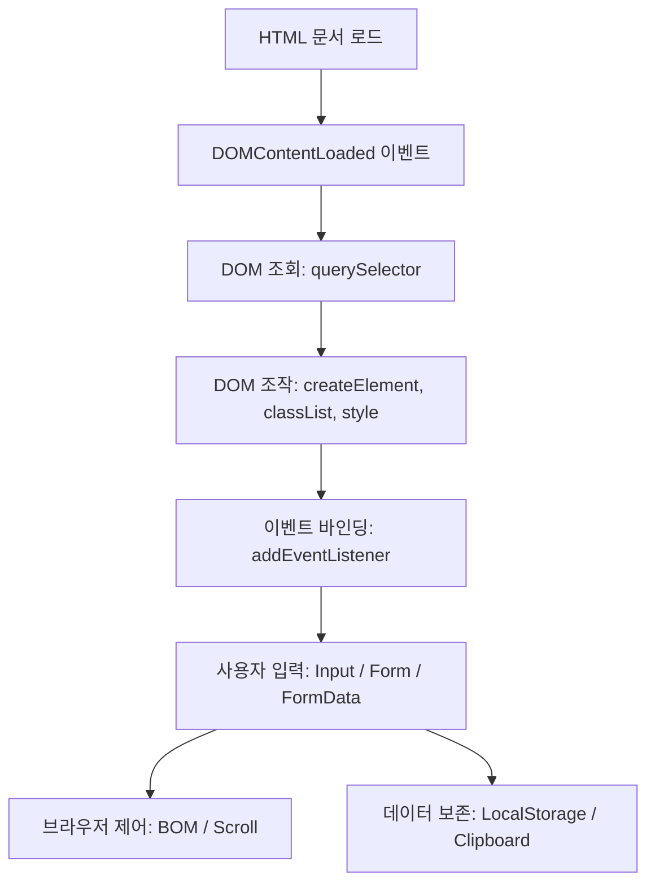
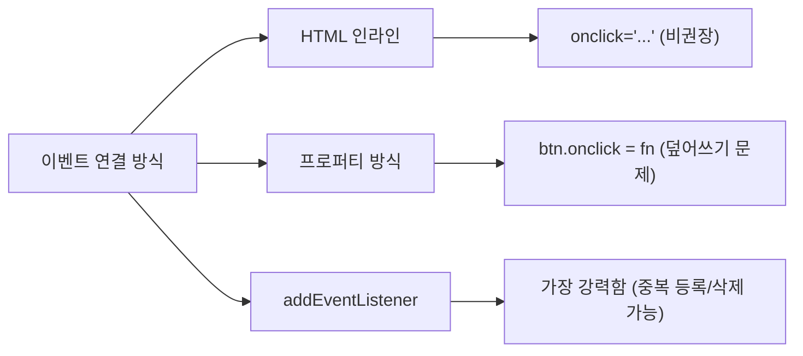
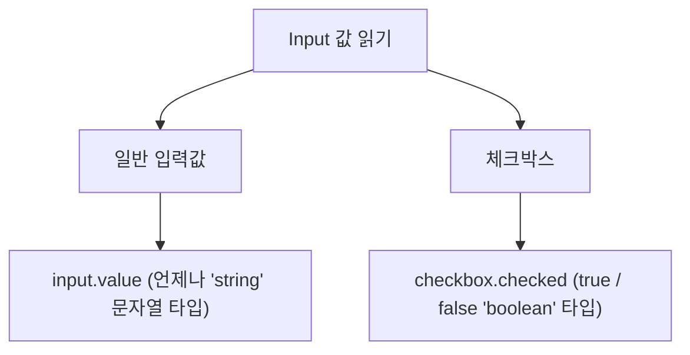

# 🌟 오늘 배운 HTML & JavaScript 핵심 개념 한눈에 보기

오늘 연습하신 HTML과 JavaScript 웹 프론트엔드 실무 지식(DOM 조작, 이벤트 처리, 폼 검증, BOM, 스토리지 및 클립보드)을 초보자도 이해하기 쉬운 비유와 코드 예제로 요약 정리했습니다.

이 파일은 학습 교재로 편하게 열람하시고, 실제 작동하는 모습은 함께 생성된 **`study_summary.html`** 파일을 브라우저로 열어서 직접 눌러보세요!

---

## 📌 전체 흐름도
우리가 배운 개념들이 웹 브라우저 안에서 어떻게 연결되는지 나타낸 지도입니다:



---

## 1. DOM 조회 (DOM Read) 🔍
> **비유**: 방 안에 있는 물건들 중 내가 원하는 물건을 콕 집어 가리키는 손가락!

HTML 태그들을 JavaScript가 읽을 수 있도록 선택하는 방법입니다.

| 메서드 | 대상 | 반환 타입 | 특징 |
| :--- | :--- | :--- | :--- |
| `document.querySelector('선택자')` | 매칭되는 **첫 번째** 요소 | 단일 객체 (Element) | 없으면 `null` 반환 |
| `document.querySelectorAll('선택자')` | 매칭되는 **모든** 요소 | 노드 리스트 (NodeList) | 배열처럼 `[index]`로 접근, 전개 연산자(`...`)로 펼칠 수 있음 |

### 💡 핵심 선택자 규칙
* **태그 선택**: `document.querySelector("p")` (가장 먼저 나오는 `<p>` 태그)
* **ID 선택 (`#`)**: `document.querySelector("#healer")` (고유한 ID가 healer인 요소)
* **클래스 선택 (`.`)**: `document.querySelectorAll(".job")` (클래스가 job인 모든 요소)

---

## 2. DOM 조작 (DOM Managing) 🏗️
> **비유**: 점토로 새로운 모형을 빚고(`create`), 색칠하고(`style`), 옷을 입히고(`classList`), 제자리에 붙이거나(`append`) 부수는 것(`remove`)!

### 🧱 핵심 메서드 & 프로퍼티
1. **요소 생성**: `const box = document.createElement("div");`
2. **텍스트 넣기 (안전성 비교)**:
   * 🔴 `innerHTML`: HTML 코드를 직접 해석하여 렌더링. 편리하지만 사용자가 입력한 악성 스크립트가 실행될 위험이 있어 **보안에 취약**합니다.
   * 🟢 `textContent`: 텍스트 자체를 단순 문자로 대입. 화면 렌더링 과정을 거치지 않아 **안전하고 속도가 빠릅니다**. (권장)
3. **클래스 조작 (`classList`)**:
   * `box.classList.add("switch")` : 클래스 추가
   * `box.classList.remove("border")` : 클래스 제거
   * `box.classList.toggle("switch")` : 클래스가 있으면 제거하고, 없으면 추가 (전등 스위치 역할)
4. **스타일 직접 조작**:
   * CSS 속성명은 `font-size`와 같은 **kebab-case**이지만, JavaScript에서는 `style.fontSize`와 같이 **camelCase**로 적어주어야 합니다!
5. **화면에 붙이기 & 지우기**:
   * `container.append(box)`: 컨테이너의 맨 마지막 자식으로 요소를 추가합니다.
   * `box.remove()`: 자기 자신을 화면에서 깨끗하게 지웁니다.

---

## 3. 이벤트 리스너 (Event Listener) ⚡
> **비유**: "누군가 버튼을 클릭하면(이벤트), 알림창을 띄워라(동작)" 하고 브라우저에 예약을 걸어두는 것!

이벤트를 연결하는 방식은 크게 3가지가 있습니다.



### 1) HTML 인라인 방식 (비권장)
```html
<button onclick="console.log('클릭!')">버튼</button>
```
* HTML과 JS 코드가 뒤섞여 유지보수가 힘들어집니다.

### 2) DOM 프로퍼티 방식 (비권장)
```javascript
btn.onclick = function() { console.log("A"); };
btn.onclick = function() { console.log("B"); }; // A가 덮어씌워져 사라짐!
```
* 하나의 이벤트에 단 하나의 함수만 등록할 수 있어서 코드가 덮어씌워지는 치명적인 문제가 있습니다.

### 3) `addEventListener` 방식 (강력 권장! ⭐)
```javascript
btn.addEventListener("click", () => console.log("A"));
btn.addEventListener("click", () => console.log("B")); // A와 B 둘 다 차례대로 실행됨!
```
* 여러 개의 함수를 자유롭게 등록할 수 있고, 실행 흐름을 제어하기 좋습니다.
* **이벤트 지우기 (`removeEventListener`)**: 이벤트를 지우려면 반드시 **이름이 있는 함수**를 전달해야 합니다. 익명 함수나 화살표 함수를 즉석에서 넣으면 지울 수 없습니다.
  ```javascript
  const handleAlert = () => console.log("알림!");
  btn.addEventListener("click", handleAlert);
  btn.removeEventListener("click", handleAlert); // 정상 제거!
  ```

---

## 4. 이벤트 타입과 DOM 진입점 📅
### 🚪 DOMContentLoaded (최적의 진입점)
HTML 문서 구조(DOM 트리)가 완전히 준비되었을 때 발생하는 이벤트입니다. 
이미지나 CSS 파일이 로드되기 전이라도 바로 작동하므로, **안전하게 DOM 요소를 찾아 조작하는 최적의 타이밍**을 잡을 때 사용합니다.
```javascript
document.addEventListener("DOMContentLoaded", () => {
    // 이제 HTML 요소를 안전하게 불러와 조작할 수 있습니다!
});
```

### ⌨️ 대표적인 Input 관련 이벤트
* **`input`**: 사용자가 값을 한 글자라도 타이핑할 때마다 즉각 작동합니다. (실시간 검색, 글자수 제한 등에 적합)
* **`change`**: 텍스트를 다 입력한 뒤, 입력창 바깥을 클릭하여 **포커스가 풀려야(blur)** 작동합니다.
* **`focus`**: 입력창을 클릭해서 커서가 깜빡이기 시작할 때 발생합니다.
* **`blur`**: 입력창 바깥을 클릭하여 선택을 해제했을 때 발생합니다.

---

## 5. 다양한 Input과 값 읽기 ⌨️
사용자가 화면에 입력하는 다양한 타입의 입력을 JavaScript로 읽어내는 방식입니다.



### ⚠️ 주의할 점
1. **타입의 마법**: `<input type="number">`에 숫자를 입력하더라도 JavaScript에서 `.value`로 가져오면 숫자가 아닌 **문자열(`"10"`)**로 읽어옵니다. 숫자로 계산하려면 `Number()`나 `parseInt()`로 변환해 주어야 합니다!
2. **체크박스**: 체크 여부는 `.value`가 아닌 `.checked` 프로퍼티를 사용하여 `true` 또는 `false` 값을 읽어야 합니다.
3. **라벨(Label) 연결**: 사용자가 글씨만 눌러도 입력창이 선택되게 하려면 `<label for="inputID">이름</label>`과 `<input id="inputID">`처럼 `for`와 `id`를 맞춰주거나, `<label>`로 입력창을 감싸주어야 합니다.

---

## 6. Form 제출과 데이터 처리 폼 📄
### 🚫 `event.preventDefault()`의 역할
HTML의 `<form>` 안에 있는 `<button>`을 클릭하면 브라우저는 기본적으로 페이지를 새로고침하며 데이터를 전송(submit)하려고 합니다. 
하지만 현대 웹에서는 페이지가 새로고침되는 것을 막고 JavaScript로 부드럽게 데이터를 가공하여 처리합니다.
이때 **브라우저의 기본 새로고침 동작을 멈추게 하는 비밀번호**가 바로 `event.preventDefault()` 입니다!

### 💼 FormData를 통한 스마트한 객체 변환
폼 안에 입력필드가 많을 때, 하나하나 `querySelector`로 읽어오면 코드가 지저분해집니다. `FormData`를 이용하면 아주 세련되게 객체화할 수 있습니다!

```javascript
form.addEventListener("submit", (event) => {
    event.preventDefault(); // 1. 새로고침 방지
    
    // 2. Form 내의 name 속성이 들어간 값들을 한 번에 수집
    const formData = new FormData(event.target);
    
    // 3. 한 번에 보기 좋은 깔끔한 JavaScript 객체로 변환!
    const dataObj = Object.fromEntries(formData);
    console.log(dataObj); // 결과: { username: "홍길동", pokemon: "파이리" }
});
```

---

## 7. BOM (Browser Object Model) 🌐
> **비유**: HTML 창 내부가 아닌, 뒤로 가기 / 앞으로 가기 / 주소창 / 전체 창 크기 등 **웹 브라우저 시스템 자체**를 다루는 도구!

### 🌍 `globalThis`와 `window`
브라우저 환경에서 최상위 전역 객체는 `window`입니다. 우리가 자주 쓰는 `console.log()`나 `setTimeout()`도 실제로는 `window.console.log()`, `window.setTimeout()`과 같이 window 객체 소속입니다. `globalThis`는 어떤 환경(브라우저, Node.js 등)에서든 전역 객체를 통일되게 가리키는 현대 표준어입니다.

### ⏱️ 시간 타이머 함수
* `setTimeout(함수, 밀리초)`: 설정한 시간이 지난 후 **단 한 번** 실행합니다. (1000ms = 1초)
* `setInterval(함수, 밀리초)`: 설정한 시간마다 **주기적으로 반복**해서 실행합니다.
* 타이머를 멈추고 싶을 때는 `clearTimeout(ID)` 또는 `clearInterval(ID)`을 사용합니다.

### 📜 창 크기 및 스크롤 제어
* `window.innerWidth` / `innerHeight` : 브라우저 화면의 순수 가로/세로 크기(픽셀).
* `scrollBy(x, y)`: **현재 위치 기준**으로 주어진 픽셀만큼 스크롤을 상대 이동시킵니다.
* `scrollTo(x, y)`: 페이지의 **절대 좌표** 위치로 스크롤을 즉시 이동시킵니다.

---

## 8. 웹 스토리지 & 클립보드 💾
### 📦 LocalStorage vs SessionStorage
브라우저에서 데이터를 영구적 혹은 임시적으로 보관할 수 있는 간이 데이터베이스입니다.

| 스토리지 종류 | 데이터 보존 기간 | 특징 |
| :--- | :--- | :--- |
| **LocalStorage** (로컬) | 직접 지우기 전까지 **영구 보존** | 브라우저나 창을 닫아도 데이터가 유지됨 |
| **SessionStorage** (세션) | **탭이 닫히면 소멸** | 특정 탭 안에서만 유지되고, 탭이 꺼지면 삭제됨 |

### ⚠️ JSON 변환의 중요성 ⭐⭐⭐
웹 스토리지는 오직 **문자열(String)**만 저장할 수 있습니다. 
JavaScript의 객체(`{}`)나 배열(`[]`)을 그대로 넣으면 브라우저가 강제로 문자열로 변환하여 `"[object Object]"`가 되어버립니다. 이를 막기 위해 JSON 형식을 사용해야 합니다.

```javascript
const user = { name: "윌리엄", age: 30 };

// 🟢 저장할 때: 객체를 문자열로 직렬화
localStorage.setItem("user", JSON.stringify(user));

// 🟢 가져올 때: 문자열을 다시 원래 객체로 역직렬화
const savedUser = JSON.parse(localStorage.getItem("user"));
console.log(savedUser.name); // "윌리엄" 출력!
```

### 📋 클립보드 복사 (`navigator.clipboard`)
사용자의 클립보드(복사 영역)에 글씨를 집어넣거나 읽어옵니다.
* **복사하기 (쓰기)**: `navigator.clipboard.writeText("복사할 텍스트")`
* **가져오기 (읽기)**: `await navigator.clipboard.readText()` (비동기 처리 필요)

---

## 🚀 실전 종합: 메모 앱의 메모리 보존 공식!
우리가 실습한 `docs/memo_complete.html`은 다음 구조로 데이터를 보존하고 관리합니다.

1. **메모 입력 & 폼 제출**:
   * 사용자가 폼에 입력 후 제출하면 `preventDefault()`로 새로고침을 막습니다.
   * `Date.now().toLocaleString()`을 고유 ID로 삼아 신규 메모 데이터를 생성합니다.
2. **LocalStorage에 저장**:
   * 기존 스토리지에 저장되어 있던 JSON 데이터를 가져와(`getItem`) 객체로 변환(`parse`)합니다.
   * 신규 메모를 객체에 추가하고, 다시 JSON 문자열로 바꿔(`stringify`) 저장(`setItem`)합니다.
3. **화면 렌더링**:
   * 페이지가 처음 켜질 때 `DOMContentLoaded` 이벤트가 발생하면, LocalStorage에서 데이터를 읽어와 반복문을 통해 화면에 메모(`p` 태그)와 삭제 버튼을 동적으로 생성해 붙여줍니다(`append`).
4. **삭제 로직**:
   * 메모 우측의 '삭제' 버튼을 클릭하면 화면에서 태그를 지우고(`memo.remove()`), LocalStorage 내 해당 ID의 값을 지워 동기화합니다.
